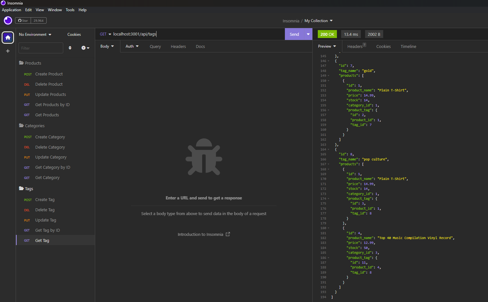

# E-Commerce Back End
The following is an e-commerce back end web application. The web application was built utilizing Object-Relational Mapping (ORMs) with Express.js, Sequelize and MySQL databases. 

## Purpose of Assignment
- The main focus of this assignment was making a functional back-end for an e-commerce web site.
- The web app is designed for an internet retail company that wants a back-end for their site using latest technologies.
- The databases are created in MySQL utilizing Sequelize to set up the tables and seed the starter data into them.
- The Client can use Insomnia to search all products, categories or tags.
- The Client can also get products, categories or tags listed by searching the specific id of what they are looking for.
- Records in the database can be created, updated and deleted easily in the database as the e-store changes. 

## Instructions for the User
 - Please use app and comment on any errors.

## Screen Shot of Working Application

## Link to GitHub Repository
[Click Here to View GitHub Repo](https://github.com/Aidan-Windebank/e-commerce-back-end)

## Link to Screencast Video to See Application in Use
[Click Here to View Video](https://drive.google.com/file/d/1nTLFRpEk5yVn0jZlL3WN3fIlDcFJ4DEX/view)